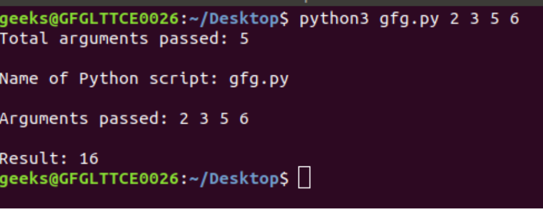

# command-line-arguments-to-count-word
## AIM:
To write a python program for getting the word count from the contents of a file using command line arguments.
## EQUIPEMENT'S REQUIRED: 
PC
Anaconda - Python 3.7
## ALGORITHM: 
### Step 1:

### Step 2: 
 
### Step 3: 

### Step 4:  

### Step 5: 

### Step 6: 

## PROGRAM:
```
import sys
n = len(sys.argv)
print("Total arguments passed:", n)
 
print("\nName of Python script:", sys.argv[0])
 
print("\nArguments passed:", end = " ")
for i in range(1, n):
    print(sys.argv[i], end = " ")
    
Sum = 0
for i in range(1, n):
    Sum += int(sys.argv[i])
     
print("\n\nResult:", Sum)
```

### OUTPUT:



## RESULT:
Thus the program is written to find the word count from the contents of a file using command line arguments.
